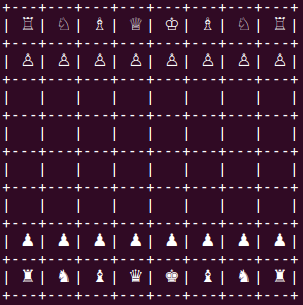

# Chess-ai
Chess engine implemented from scratch in C++. 



## Table of contents
* [Features](#Features)
* [Requirements](#Requirements)
* [Getting started](#Getting-started)
  * [Linux](#Linux)
  * [Windows](#Windows)
* [Usage](#Usage)

## Features
* Bitboards
  * Magic bitboards
* Move generator
  * Make/unmake move
  * Castle
  * Promotion
* Search
  * Negamax with alpha-beta pruning
  * Quiescence search
* Evaluation
  * Material
  * Positional

## Requirements
* UTF-8 compatible shell
* C++11 or better

## Getting started
### Linux
```
  git clone https://github.com/FredrikErikJohansson/chess-ai.git
  cd chess-ai
  make
  ./chess
```

### Windows
```
  git clone https://github.com/FredrikErikJohansson/chess-ai.git
```
Include the `src/` directory into a Visual Sudio project and run from the IDE. You may have to tweak some compiler flags to get optimal performance.

## Usage
The engine is predefind with values for good performance. To make a move from e2 to e4, type `e2e4`.
